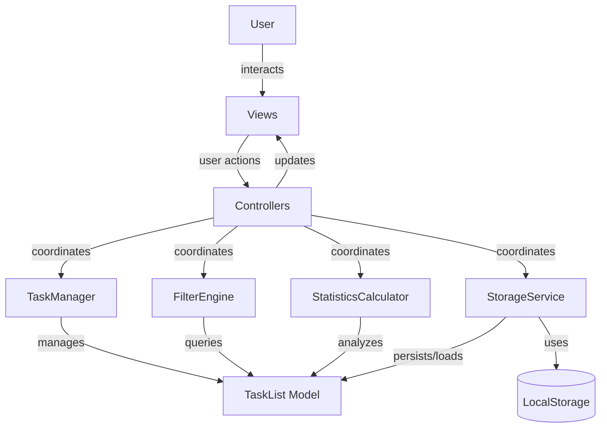

# Technical Design Document: Todo App

## Overview

The Todo App is a client-side web application for task management with persistent storage, built using vanilla JavaScript, HTML5, and CSS3. The application follows a layered architecture with clear separation between data models, business logic, and UI rendering.

### Core Features
- Task CRUD operations with validation
- Priority levels and category organization
- Search, filter, and sort capabilities
- Progress tracking and statistics
- Local storage persistence
- Responsive design (mobile, tablet, desktop)
- Smooth CSS animations

### Technology Stack
- **Frontend**: Vanilla JavaScript (ES6+), HTML5, CSS3
- **Storage**: Browser LocalStorage API
- **Testing**: Jest for unit tests, fast-check for property-based tests
- **Build**: Webpack or Vite for module bundling
- **Code Quality**: ESLint, Prettier

## Architecture

### Layered Architecture Pattern

```
┌─────────────────────────────────────────────┐
│              Views (UI Layer)               │
│  - TaskListView, TaskFormView,              │
│    StatisticsView, FilterView               │
└───────────────┬─────────────────────────────┘
                │ renders/updates
                ↓
┌─────────────────────────────────────────────┐
│           Controllers (Coordination)         │
│  - TaskController, FilterController,         │
│    StatisticsController                      │
└───────────────┬─────────────────────────────┘
                │ coordinates
                ↓
┌─────────────────────────────────────────────┐
│          Services (Business Logic)           │
│  - TaskManager, StorageService,              │
│    FilterEngine, StatisticsCalculator        │
└───────────────┬─────────────────────────────┘
                │ uses
                ↓
┌─────────────────────────────────────────────┐
│           Models (Data Structures)           │
│  - Task, TaskList, FilterCriteria,           │
│    Statistics                                │
└─────────────────────────────────────────────┘
```

### Component Interactions



### Dependency Flow
- Views depend on Controllers (no direct service access)
- Controllers depend on Services (coordinate business logic)
- Services depend on Models (operate on data structures)
- No reverse dependencies (Models don't know about Services, Services don't know about Controllers)

## Components and Interfaces

### 1. Models Layer

#### Task Model
```typescript
interface Task {
  id: string;              // UUID v4
  title: string;           // 1-200 characters
  description: string;     // 0-1000 characters
  priority: Priority;      // enum: Low | Medium | High | Critical
  category: string;        // 1-50 characters
  status: TaskStatus;      // enum: active | completed
  createdAt: string;       // ISO 8601 timestamp
  completedAt: string | null; // ISO 8601 timestamp or null
}

enum Priority {
  Low = "Low",
  Medium = "Medium",
  High = "High",
  Critical = "Critical"
}

enum TaskStatus {
  Active = "active",
  Completed = "completed"
}
```

#### TaskList Model
```typescript
class TaskList {
  private tasks: Map<string, Task>;
  
  constructor(tasks?: Task[]);
  add(task: Task): void;
  update(taskId: string, updates: Partial<Task>): Task;
  remove(taskId: string): void;
  get(taskId: string): Task | undefined;
  getAll(): Task[];
  size(): number;
}
```

#### FilterCriteria Model
```typescript
interface FilterCriteria {
  searchQuery?: string;    // 1-500 characters
  priority?: Priority[];   // filter by one or more priorities
  category?: string[];     // filter by one or more categories
  status?: TaskStatus[];   // filter by one or more statuses
  sortBy?: SortField;      // priority | createdAt | completedAt
  sortOrder?: SortOrder;   // asc | desc
}

enum SortField {
  Priority = "priority",
  CreatedAt = "createdAt",
  CompletedAt = "completedAt"
}

enum SortOrder {
  Ascending = "asc",
  Descending = "desc"
}
```

#### Statistics Model
```typescript
interface Statistics {
  totalTasks: number;
  completedTasks: number;
  activeTasks: number;
  completionPercentage: number;  // rounded to 1 decimal
  tasksByPriority: {
    Low: number;
    Medium: number;
    High: number;
    Critical: number;
  };
  tasksByCategory: Map<string, number>;
}
```

### 2. Services Layer

#### TaskManager Service
```typescript
class TaskManager {
  private taskList: TaskList;
  
  // Create
  createTask(title: string, options?: CreateTaskOptions): Result<Task, ValidationError>;
  
  // Read
  getTask(taskId: string): Result<Task, NotFoundError>;
  getAllTasks(): Task[];
  
  // Update
  updateTask(taskId: string, updates: TaskUpdate): Result<Task, ValidationError | NotFoundError>;
  completeTask(taskId: string): Result<Task, NotFoundError>;
  
  // Delete
  deleteTask(taskId: string): Result<void, NotFoundError>;
  
  // Validation
  private validateTitle(title: string): ValidationResult;
  private validatePriority(priority: string): ValidationResult;
  private validateCategory(category: string): ValidationResult;
  private validateDescription(description: string): ValidationResult;
}

interface CreateTaskOptions {
  description?: string;
  priority?: Priority;
  category?: string;
}

interface TaskUpdate {
  title?: string;
  description?: string;
  priority?: Priority;
  category?: string;
}
```

**Key Algorithms:**
- **Validation**: Title length (1-200), description length (≤1000), category length (1-50), priority enum validation
- **ID Generation**: UUID v4 using crypto.randomUUID()
- **Timestamp Generation**: ISO 8601 format using `new Date().toISOString()`
- **Default Values**: priority="Medium", category="Uncategorized", description=""

#### StorageService
```typescript
class StorageService {
  private readonly STORAGE_KEY = "todoAppTasks";
  private readonly RETRY_DELAY_MS = 1000;
  
  // Persistence
  saveTasks(tasks: Task[]): Promise<Result<void, StorageError>>;
  loadTasks(): Promise<Result<Task[], StorageError>>;
  
  // Error Handling
  private handleQuotaExceeded(): void;
  private retryOperation<T>(operation: () => Promise<T>): Promise<T>;
  
  // Validation
  private validateSchema(data: unknown): data is Task[];
}
```

**Key Algorithms:**
- **Serialization**: `JSON.stringify(tasks)` with schema validation
- **Deserialization**: `JSON.parse(data)` with schema validation and error recovery
- **Error Recovery**: Single retry after 1 second for non-quota errors
- **Schema Validation**: Validate all required Task fields and types

#### FilterEngine Service
```typescript
class FilterEngine {
  // Main filtering
  applyFilters(tasks: Task[], criteria: FilterCriteria): Task[];
  
  // Search
  private searchTasks(tasks: Task[], query: string): Task[];
  
  // Filter
  private filterByPriority(tasks: Task[], priorities: Priority[]): Task[];
  private filterByCategory(tasks: Task[], categories: string[]): Task[];
  private filterByStatus(tasks: Task[], statuses: TaskStatus[]): Task[];
  
  // Sort
  private sortTasks(tasks: Task[], sortBy: SortField, order: SortOrder): Task[];
  
  // Validation
  private validateSearchQuery(query: string): ValidationResult;
}
```

**Key Algorithms:**

1. **Search Algorithm** (case-insensitive substring match):
```javascript
searchTasks(tasks, query) {
  const lowerQuery = query.toLowerCase();
  return tasks.filter(task => 
    task.title.toLowerCase().includes(lowerQuery) ||
    task.description.toLowerCase().includes(lowerQuery)
  );
}
```

2. **Filter Application Order**:
   - Step 1: Apply priority filter
   - Step 2: Apply category filter
   - Step 3: Apply status filter
   - Step 4: Apply search query
   - Step 5: Apply sort

3. **Sort Algorithm** (priority levels: Critical > High > Medium > Low):
```javascript
sortTasks(tasks, sortBy, order) {
  const priorityWeight = { Critical: 4, High: 3, Medium: 2, Low: 1 };
  
  const sorted = [...tasks].sort((a, b) => {
    if (sortBy === 'priority') {
      return priorityWeight[a.priority] - priorityWeight[b.priority];
    } else if (sortBy === 'createdAt' || sortBy === 'completedAt') {
      return new Date(a[sortBy]) - new Date(b[sortBy]);
    }
  });
  
  return order === 'desc' ? sorted.reverse() : sorted;
}
```

4. **Immutability**: All filter/sort operations return new arrays without mutating inputs

#### StatisticsCalculator Service
```typescript
class StatisticsCalculator {
  calculateStatistics(tasks: Task[]): Statistics;
  
  private countTotal(tasks: Task[]): number;
  private countCompleted(tasks: Task[]): number;
  private calculateCompletionPercentage(completed: number, total: number): number;
  private groupByPriority(tasks: Task[]): Record<Priority, number>;
  private groupByCategory(tasks: Task[]): Map<string, number>;
}
```

**Key Algorithms:**

1. **Completion Percentage**:
```javascript
calculateCompletionPercentage(completed, total) {
  if (total === 0) return 0.0;
  return Math.round((completed / total) * 1000) / 10; // round to 1 decimal
}
```

2. **Grouping by Priority/Category**:
```javascript
groupByPriority(tasks) {
  return tasks.reduce((acc, task) => {
    acc[task.priority] = (acc[task.priority] || 0) + 1;
    return acc;
  }, { Low: 0, Medium: 0, High: 0, Critical: 0 });
}
```

### 3. Controllers Layer

#### TaskController
```typescript
class TaskController {
  constructor(
    private taskManager: TaskManager,
    private storageService: StorageService,
    private taskListView: TaskListView,
    private statisticsController: StatisticsController
  );
  
  async initialize(): Promise<void>;
  async handleCreateTask(title: string, options?: CreateTaskOptions): Promise<void>;
  async handleUpdateTask(taskId: string, updates: TaskUpdate): Promise<void>;
  async handleCompleteTask(taskId: string): Promise<void>;
  async handleDeleteTask(taskId: string): Promise<void>;
  
  private async persistAndRefresh(): Promise<void>;
  private handleError(error: Error): void;
}
```

#### FilterController
```typescript
class FilterController {
  constructor(
    private filterEngine: FilterEngine,
    private taskManager: TaskManager,
    private filterView: FilterView,
    private taskListView: TaskListView
  );
  
  handleSearch(query: string): void;
  handleFilterChange(criteria: Partial<FilterCriteria>): void;
  handleSortChange(sortBy: SortField, order: SortOrder): void;
  
  private applyFiltersAndUpdate(): void;
  private preserveSortOption(): void;
}
```

#### StatisticsController
```typescript
class StatisticsController {
  constructor(
    private statisticsCalculator: StatisticsCalculator,
    private taskManager: TaskManager,
    private statisticsView: StatisticsView
  );
  
  refresh(): void;
  private renderStatistics(stats: Statistics): void;
}
```

### 4. Views Layer

#### TaskListView
```typescript
class TaskListView {
  private container: HTMLElement;
  
  render(tasks: Task[]): void;
  renderTask(task: Task): void;
  updateTask(taskId: string, task: Task): void;
  removeTask(taskId: string): void;
  
  // Animation methods
  private animateTaskAddition(element: HTMLElement): void;
  private animateTaskRemoval(element: HTMLElement): void;
  private animateTaskCompletion(element: HTMLElement): void;
  
  // Event handlers (delegate to controller)
  onTaskEdit: (taskId: string) => void;
  onTaskComplete: (taskId: string) => void;
  onTaskDelete: (taskId: string) => void;
}
```

#### TaskFormView
```typescript
class TaskFormView {
  private form: HTMLFormElement;
  
  render(): void;
  getFormData(): CreateTaskOptions;
  resetForm(): void;
  showValidationError(field: string, message: string): void;
  
  onSubmit: (data: CreateTaskOptions) => void;
}
```

#### FilterView
```typescript
class FilterView {
  private container: HTMLElement;
  
  render(): void;
  getSearchQuery(): string;
  getSelectedFilters(): Partial<FilterCriteria>;
  
  onSearchChange: (query: string) => void;
  onFilterChange: (criteria: Partial<FilterCriteria>) => void;
  onSortChange: (sortBy: SortField, order: SortOrder) => void;
}
```

#### StatisticsView
```typescript
class StatisticsView {
  private container: HTMLElement;
  
  render(stats: Statistics): void;
  private renderProgressBar(percentage: number): void;
  private renderPriorityBreakdown(breakdown: Record<Priority, number>): void;
  private renderCategoryBreakdown(breakdown: Map<string, number>): void;
}
```

## Data Models

### Task Data Structure

```javascript
{
  id: "550e8400-e29b-41d4-a716-446655440000",  // UUID v4
  title: "Complete project documentation",      // 1-200 chars
  description: "Write technical design...",     // 0-1000 chars
  priority: "High",                             // Low|Medium|High|Critical
  category: "Work",                             // 1-50 chars
  status: "active",                             // active|completed
  createdAt: "2024-01-15T10:30:00.000Z",       // ISO 8601
  completedAt: null                             // ISO 8601 or null
}
```

### Storage Format (LocalStorage)

**Key**: `"todoAppTasks"`

**Value** (JSON string):
```json
[
  {
    "id": "uuid-1",
    "title": "Task 1",
    "description": "Description 1",
    "priority": "High",
    "category": "Work",
    "status": "active",
    "createdAt": "2024-01-15T10:30:00.000Z",
    "completedAt": null
  },
  {
    "id": "uuid-2",
    "title": "Task 2",
    "description": "Description 2",
    "priority": "Medium",
    "category": "Personal",
    "status": "completed",
    "createdAt": "2024-01-14T09:00:00.000Z",
    "completedAt": "2024-01-15T11:00:00.000Z"
  }
]
```

### In-Memory State

```javascript
// TaskManager internal state
{
  taskList: TaskList {
    tasks: Map {
      "uuid-1" => Task { /* task 1 data */ },
      "uuid-2" => Task { /* task 2 data */ }
    }
  }
}

// FilterController internal state
{
  currentCriteria: {
    searchQuery: "documentation",
    priority: ["High", "Critical"],
    category: null,
    status: ["active"],
    sortBy: "priority",
    sortOrder: "desc"
  }
}
```

## Correctness Properties

*A property is a characteristic or behavior that should hold true across all valid executions of a system—essentially, a formal statement about what the system should do. Properties serve as the bridge between human-readable specifications and machine-verifiable correctness guarantees.*

### Property 1: Task Creation Produces Valid Task Objects

*For any* valid task title (non-empty, ≤200 characters), when a task is created, the resulting task SHALL have a unique ID, a valid ISO 8601 creation timestamp, status "active", and all required properties (id, title, description, priority, category, status, createdAt, completedAt).

**Validates: Requirements 1.1, 1.9, 2.5**

### Property 2: Invalid Task Titles Are Rejected

*For any* invalid task title (empty, null, or >200 characters), task creation SHALL be rejected and return an error message.

**Validates: Requirements 1.2**

### Property 3: Task Editing Preserves Creation Timestamp

*For any* existing task and any valid new title, editing the task title SHALL update the title while preserving the original creation timestamp unchanged.

**Validates: Requirements 1.3**

### Property 4: Task Completion Updates Status and Timestamp

*For any* existing active task, marking it as complete SHALL update the status to "completed" and add a valid ISO 8601 completion timestamp.

**Validates: Requirements 1.5**

### Property 5: Task Deletion Removes Task from List

*For any* existing task, deleting it SHALL remove the task from the task list such that subsequent queries for that task ID return not found.

**Validates: Requirements 1.7**

### Property 6: Valid Priorities Are Accepted

*For any* valid priority value (Low, Medium, High, or Critical), creating or editing a task with that priority SHALL accept and store the priority value.

**Validates: Requirements 2.1**

### Property 7: Invalid Priorities Are Rejected

*For any* string that is not "Low", "Medium", "High", or "Critical", creating or editing a task with that priority SHALL be rejected and return an error message indicating invalid priority.

**Validates: Requirements 2.2**

### Property 8: Valid Categories Are Accepted

*For any* non-empty category string of 50 characters or fewer, creating or editing a task with that category SHALL accept and store the category value.

**Validates: Requirements 2.3**

### Property 9: Invalid Categories Are Rejected

*For any* category that is empty, null, or exceeds 50 characters, creating or editing a task with that category SHALL be rejected and return an error message indicating invalid category.

**Validates: Requirements 2.4**

### Property 10: Default Values Are Applied

*For any* task created without explicit priority, category, or description values, the task SHALL have default values of priority="Medium", category="Uncategorized", and description="" (empty string).

**Validates: Requirements 2.6, 2.7, 2.8**

### Property 11: Search Returns Only Matching Tasks

*For any* valid search query (1-500 characters) and any task list, all returned tasks SHALL contain the search query as a case-insensitive substring in either the task title or description.

**Validates: Requirements 3.1**

### Property 12: Invalid Search Queries Are Rejected

*For any* search query of 0 characters or exceeding 500 characters, the search operation SHALL be rejected and return an error message indicating invalid query length.

**Validates: Requirements 3.2**

### Property 13: Filters Match All Selected Criteria

*For any* filter criteria (priority, category, status) and any task list, all returned tasks SHALL match ALL selected filter criteria.

**Validates: Requirements 3.4**

### Property 14: Sort Orders Tasks Correctly

*For any* sort option (priority, creation date, or completion date) and sort order (ascending or descending), the returned task list SHALL be ordered correctly by the selected attribute in the specified direction.

**Validates: Requirements 3.5, 3.6**

### Property 15: Combined Search and Filter Apply in Correct Order

*For any* combination of search query and filter criteria, the filter criteria SHALL be applied first to produce a filtered set, then the search query SHALL be applied to that filtered set.

**Validates: Requirements 3.7**

### Property 16: Filter Operations Preserve Sort Option

*For any* active sort option and any search or filter operation, applying the search or filter SHALL maintain the currently selected sort option and order.

**Validates: Requirements 3.8**

### Property 17: Storage Round-Trip Preserves Data

*For any* valid task list, serializing the task list to storage format and then deserializing it SHALL produce a task list equivalent to the original (all tasks with identical properties).

**Validates: Requirements 4.2**

### Property 18: Invalid Storage Data Triggers Error Handling

*For any* data that fails JSON schema validation, loading from storage SHALL log an error, initialize with an empty task list, and display a notification to the user.

**Validates: Requirements 4.4**

### Property 19: Task Count Statistics Are Accurate

*For any* task list, the total task count SHALL equal the number of tasks in the list, and the completed task count SHALL equal the number of tasks with status "completed".

**Validates: Requirements 5.1, 5.2**

### Property 20: Completion Percentage Is Calculated Correctly

*For any* task list with one or more tasks, the completion percentage SHALL equal (completed tasks / total tasks) × 100, rounded to 1 decimal place. For empty task lists, the completion percentage SHALL be 0.0%.

**Validates: Requirements 5.3, 5.4**

### Property 21: Priority Grouping Is Accurate

*For any* task list, the count of tasks for each priority level (Low, Medium, High, Critical) SHALL equal the actual number of tasks with that priority in the list.

**Validates: Requirements 5.5**

### Property 22: Category Grouping Is Accurate

*For any* task list, the count of tasks for each unique category SHALL equal the actual number of tasks with that category in the list.

**Validates: Requirements 5.6**

### Property 23: Filter and Sort Operations Are Pure Functions

*For any* task list and any filter or sort operation, the operation SHALL return a new filtered/sorted list without mutating the input task list.

**Validates: Requirements 8.3**

## Error Handling

### Error Types

```typescript
// Base error class
class TodoAppError extends Error {
  constructor(message: string, public code: string) {
    super(message);
    this.name = 'TodoAppError';
  }
}

// Validation errors
class ValidationError extends TodoAppError {
  constructor(field: string, message: string) {
    super(`Validation failed for ${field}: ${message}`, 'VALIDATION_ERROR');
  }
}

// Not found errors
class NotFoundError extends TodoAppError {
  constructor(resourceType: string, id: string) {
    super(`${resourceType} not found: ${id}`, 'NOT_FOUND');
  }
}

// Storage errors
class StorageError extends TodoAppError {
  constructor(message: string, public isQuotaError: boolean = false) {
    super(message, isQuotaError ? 'STORAGE_QUOTA_EXCEEDED' : 'STORAGE_ERROR');
  }
}
```

### Error Handling Strategy

1. **Validation Errors**: Return immediately with descriptive error message, display in UI near relevant field
2. **Not Found Errors**: Return error to controller, display user-friendly notification
3. **Storage Quota Errors**: Log to console, display notification to user about storage limitations
4. **Storage Failures**: Log to console, retry once after 1 second, display notification if retry fails
5. **Schema Validation Errors**: Log to console, recover with empty task list, display notification about data loss

### User Notifications

```typescript
interface Notification {
  type: 'error' | 'warning' | 'success' | 'info';
  message: string;
  duration?: number; // milliseconds, default 5000
}

// Examples
{
  type: 'error',
  message: 'Task title cannot be empty'
}

{
  type: 'warning',
  message: 'Storage quota exceeded. Some changes may not be saved.'
}

{
  type: 'error',
  message: 'Previous task data could not be recovered. Starting with empty list.'
}
```

## Testing Strategy

### Unit Testing (Jest)

**Focus**: Specific examples, edge cases, error conditions

**Coverage Areas**:
1. **Validation Logic**: Test boundary conditions (empty, max length, null values)
2. **Error Handling**: Test each error type and recovery mechanism
3. **Default Values**: Test tasks created without optional fields
4. **Empty State**: Test operations on empty task lists
5. **Integration Points**: Test controller coordination between services
6. **UI Event Handlers**: Test view event delegation to controllers

**Example Unit Tests**:
- Task creation with minimum valid input (single character title)
- Task creation with maximum valid input (200 character title)
- Task creation with invalid input (201 character title)
- Search with empty result set
- Statistics calculation with zero tasks
- Storage loading with empty localStorage
- Storage loading with corrupted data

### Property-Based Testing (fast-check)

**Library**: [fast-check](https://github.com/dubzzz/fast-check) - JavaScript/TypeScript property-based testing library

**Configuration**: Minimum 100 iterations per property test

**Test Tag Format**: Each property test SHALL include a comment tag referencing the design property:
```javascript
// Feature: todo-app, Property 1: Task Creation Produces Valid Task Objects
test('task creation produces valid task objects', () => {
  fc.assert(
    fc.property(fc.string({ minLength: 1, maxLength: 200 }), (title) => {
      // test implementation
    }),
    { numRuns: 100 }
  );
});
```

**Generator Strategies**:

1. **Task Generator**: Generate random tasks with varying properties
```javascript
const taskArbitrary = fc.record({
  title: fc.string({ minLength: 1, maxLength: 200 }),
  description: fc.string({ maxLength: 1000 }),
  priority: fc.constantFrom('Low', 'Medium', 'High', 'Critical'),
  category: fc.string({ minLength: 1, maxLength: 50 }),
});
```

2. **Invalid Input Generator**: Generate edge cases (empty, null, too long)
```javascript
const invalidTitleArbitrary = fc.oneof(
  fc.constant(''),
  fc.constant(null),
  fc.string({ minLength: 201, maxLength: 500 })
);
```

3. **Task List Generator**: Generate lists of varying sizes
```javascript
const taskListArbitrary = fc.array(taskArbitrary, { minLength: 0, maxLength: 100 });
```

**Property Test Implementation**: Each of the 23 correctness properties SHALL be implemented as a separate property-based test with 100+ iterations.

### Integration Testing

**Focus**: External dependencies, timing requirements, end-to-end workflows

**Coverage Areas**:
1. **LocalStorage Integration**: Test actual browser storage API
2. **Performance Timing**: Verify 100ms persistence, 1-2 second query response
3. **Statistics Update Timing**: Verify 500ms update after operations
4. **Storage Quota**: Mock quota exceeded scenarios
5. **Storage Failures**: Mock and verify retry logic

### UI Testing

**Focus**: Rendering, animations, responsive layout

**Tools**: Jest + Testing Library for component tests, Playwright for E2E

**Coverage Areas**:
1. **Responsive Breakpoints**: Test layout at <768px, 768-1024px, >1024px
2. **Animation Timing**: Verify 300ms animation durations
3. **State Preservation**: Verify state maintained across layout transitions
4. **Visual Regression**: Snapshot tests for UI components

### Test Organization

```
tests/
├── unit/
│   ├── models/
│   │   ├── Task.test.js
│   │   └── TaskList.test.js
│   ├── services/
│   │   ├── TaskManager.test.js
│   │   ├── StorageService.test.js
│   │   ├── FilterEngine.test.js
│   │   └── StatisticsCalculator.test.js
│   └── controllers/
│       ├── TaskController.test.js
│       ├── FilterController.test.js
│       └── StatisticsController.test.js
├── property/
│   ├── task-crud.property.test.js
│   ├── task-validation.property.test.js
│   ├── filter-search.property.test.js
│   ├── statistics.property.test.js
│   └── storage.property.test.js
├── integration/
│   ├── storage-integration.test.js
│   ├── performance.test.js
│   └── error-recovery.test.js
└── ui/
    ├── views/
    │   ├── TaskListView.test.js
    │   ├── FilterView.test.js
    │   └── StatisticsView.test.js
    └── e2e/
        ├── task-workflow.spec.js
        └── responsive-layout.spec.js
```

### Test Coverage Goals

- **Unit Tests**: 90% code coverage for services and controllers
- **Property Tests**: 100% coverage of all 23 correctness properties
- **Integration Tests**: All external dependencies and timing requirements
- **UI Tests**: All view components and responsive breakpoints

### Continuous Testing

- Run unit tests and property tests on every commit
- Run integration tests on pull requests
- Run E2E tests before deployment
- Monitor property test failure patterns to identify edge cases
